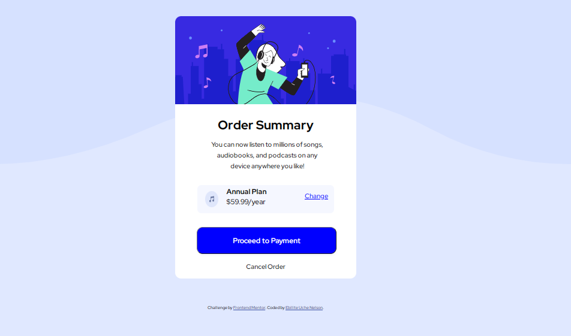

# Frontend Mentor - Order summary card solution

This is a solution to the [Order summary card challenge on Frontend Mentor](https://www.frontendmentor.io/challenges/order-summary-component-QlPmajDUj). Frontend Mentor challenges help you improve your coding skills by building realistic projects. 

## Table of contents

- [Overview](#overview)
  - [The challenge](#the-challenge)
  - [Screenshot](#screenshot)
  - [Links](#links)
  - [Built with](#built-with)
  - [What I learned](#what-i-learned)
  - [Continued development](#continued-development)
- [Author](#author)


## Overview
This is a solution from frontend Mentor, were a order summary card was being rebuilt to help improve ones html and css.

### The challenge

Users should be able to:

- See hover states for interactive elements

### Screenshot




### Links

- Solution URL: [Add solution URL here](https://your-solution-url.com)
- Live Site URL: [Add live site URL here](https://your-live-site-url.com)


### Built with

- Semantic HTML5 markup
- CSS custom properties
- Flexbox
- Mobile-first workflow


### What I learned

1. I learned how to apply border to the top-right and top-left of an image

```css
.img img{
    width: 100%;
    display: block;
    border-top-left-radius: 15px;
    border-top-right-radius: 15px;
}
```

2. learnt more on how to deal with the responsiveness of a mobile view using padding and margin


### Continued development

1. Will love to become an expert in responsiveness na dmobile first approach.


## Author


- Frontend Mentor - [@Ebilite](https://www.frontendmentor.io/profile/EBILITE)
- Twitter - [@EbiliteN](https://www.twitter.com/EbiliteN)


